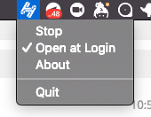

# OnomaMenubar

Displays a menu bar app that lets users route DNS traffic through a local `HNSD` SPV node. Here's a screenshot of what you'll get:

## Installation

We recommend downloading one of the DMG files from this repo's [Releases](https://github.com/kyokan/OnomaMenubar/releases) page. You may get 'unidentified developer' messages while we're going through the Apple Developer Center verifiation process. To bypass those, right-click on the application and select 'Open' from the menu.

Once we have a usable Apple Developer account, we'll use Apple's notary service to sign the binaries and the messages will go away.

## How It Works

When you click 'Start' in the app menu, `OnomaMenubar` will start two processes: `hnsd`, and a helper tool responsible for monitoring `hnsd`. It will also point the DNS servers for every network interface on your computer to `hnsd`'s recursive resolver port. When you quit `OnomaMenubar`, DNS settings will be cleared.

Currently, the application points to a simnet Kyokan created for the purposes of faster development while a new official testnet is created. To verify your installation, use the following domain: [http://megatest/](http://megatest/). You should see an aminated gif of a computer. The simnet's only node is located at `http://onoma-infra.dev.kyokan.io`.

We'll point the app to the new testnet once it's launched.

## Stability

We've been dogfooding the app since mid-December, and there haven't been any major problems. That said, this is currently beta software so *caveat user*. Please [report an issue](https://github.com/kyokan/OnomaMenubar/issues) if anything problems crop up for you.

## HNSD Version

A compiled version of `hnsd` with commit hash `895d89c25d316d18df9d374fe78aae3902bc89fb` is included in this repo. As `hnsd` gets updated, we'll also update the included binary. The `hnsd` binary is code signed alongside all other build products.

## Acknowlegements

Many thanks to Erik Berglund, whose [SwiftPrivilegedHelper](https://github.com/erikberglund/SwiftPrivilegedHelper) example application forms the basis of this app's privilege escalation and helper management code.